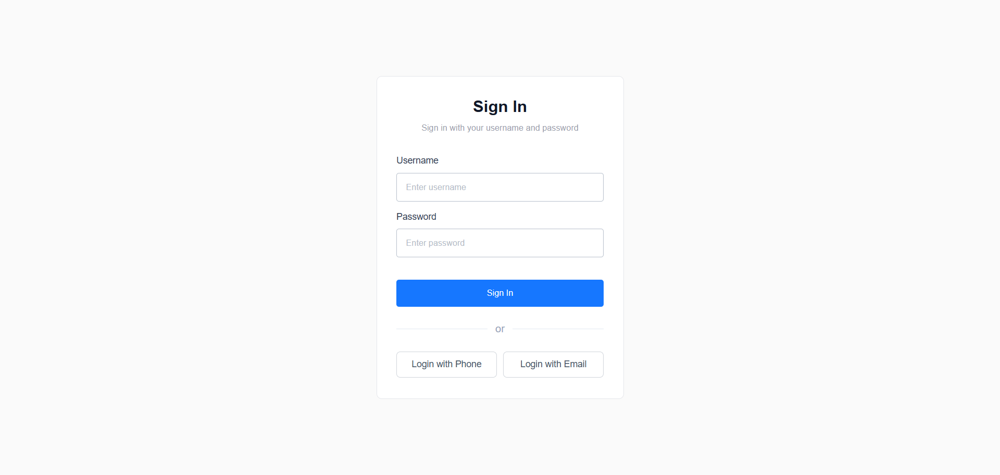
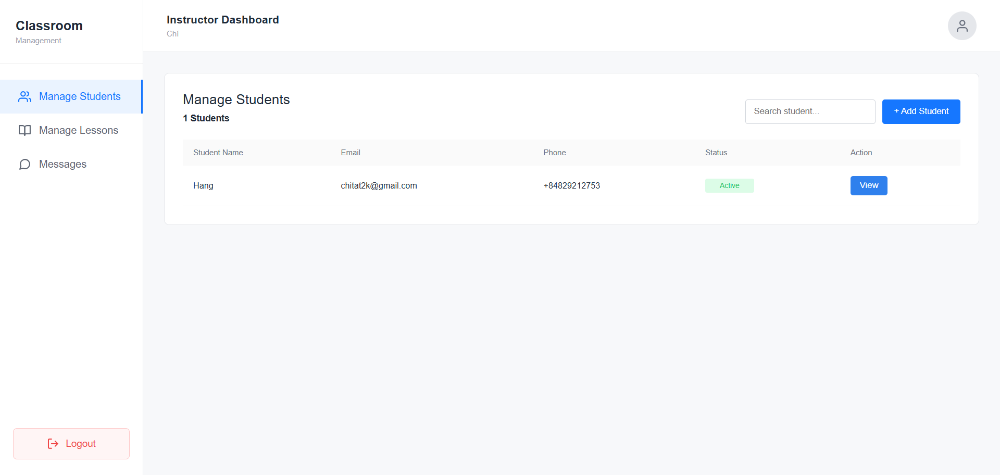
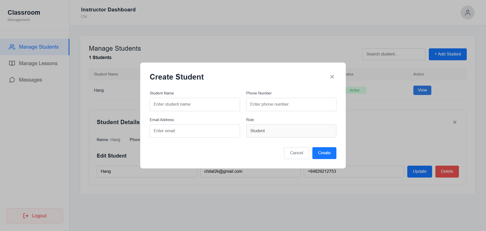
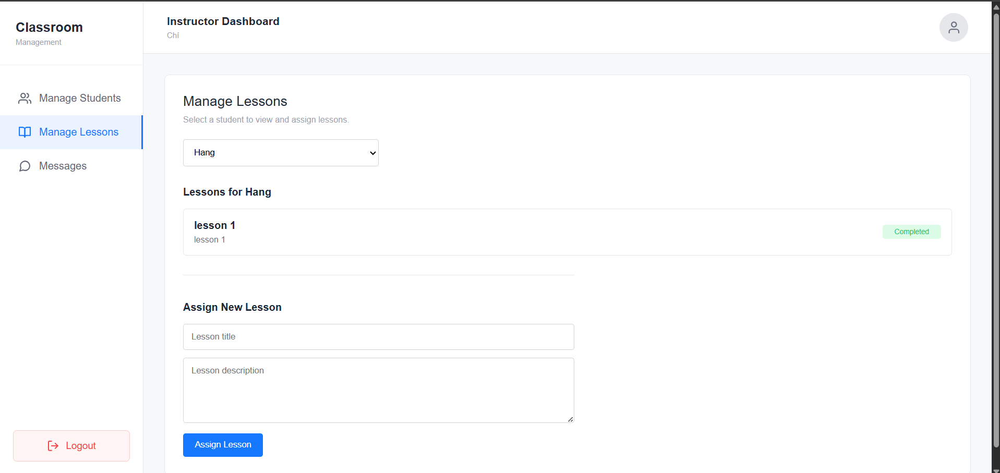
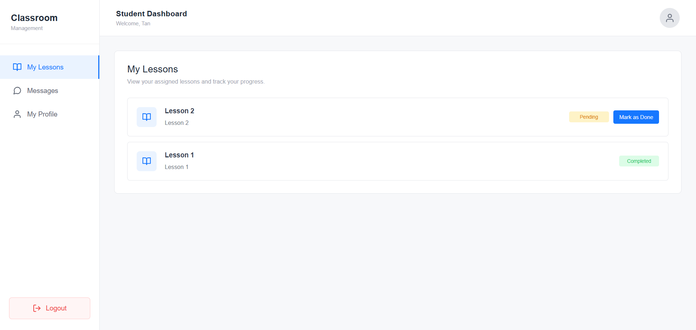
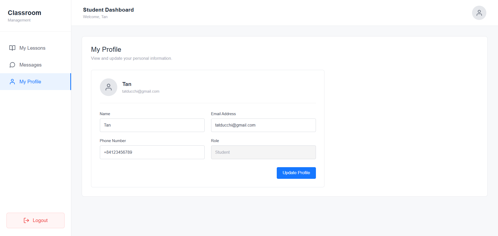
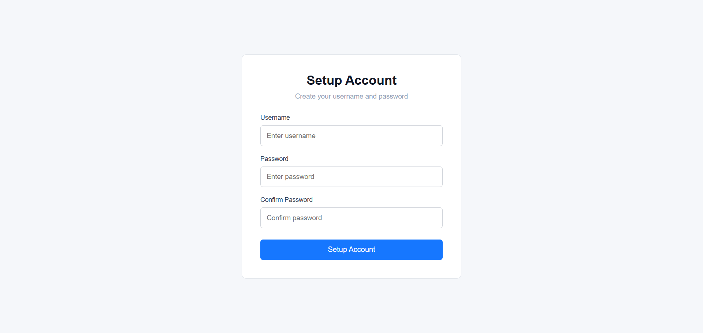
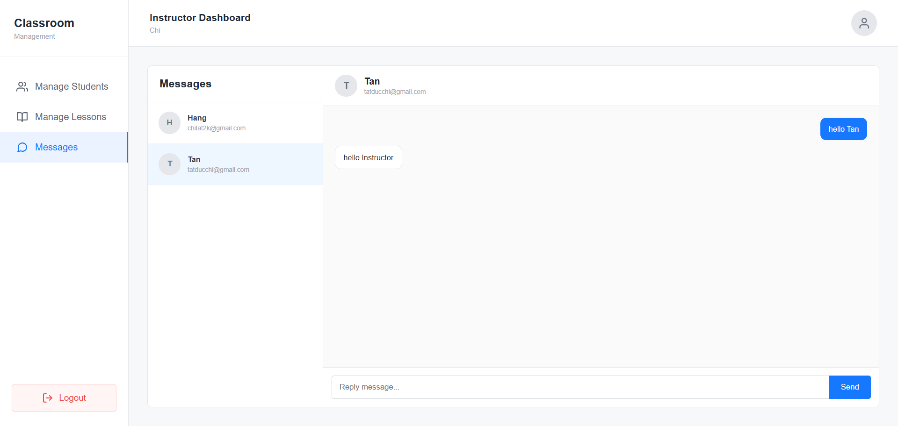

# Classroom Management App

A simple classroom management application built with React, Node.js,
Express and Firebase.

## Features

### Instructor

- Add students
- Edit student information
- Delete students
- Assign lessons
- Chat with students

### Student

- View assigned lessons
- Mark lessons as done
- Edit profile
- Chat with instructor

## Authentication

The application supports SMS access codes and student account setup through email verification.

## Tech Stack

- React
- Node.js
- Express
- Firebase / Firestore
- Socket.io
- Twilio

## Screenshots

### Login



### Instructor Dashboard



### Manage Students



### Manage Lessons



### Student Dashboard



### Student Profile



### Setup Account



### Messages



## Getting Started

### 1. Clone the repository

```bash
git clone https://github.com/chilunhay/classroom-management.git
```

### 2. Install dependencies

### Server

```bash
cd server
npm install
```

### Client - Open another terminal:

```bash
cd client
npm install
```

### 3. Configure environment variables

Create a `.env` file inside the `server` directory.

Required variables:

- `PORT`
- `EMAIL_USER`
- `EMAIL_PASS`
- `TWILIO_ACCOUNT_SID`
- `TWILIO_AUTH_TOKEN`
- `TWILIO_PHONE_NUMBER`
- Firebase:
Place your Firebase Admin SDK service account file
at server/serviceAccountKey.json.

### 4. Run the application

### Server

```bash
cd server
npm run dev
```

### Client - Open another terminal:

```bash
cd client
npm run dev
```

## Known Limitations

### SMS OTP

Twilio SMS delivery is currently unavailable in the development environment.

For testing purposes, when `NODE_ENV` is not `production`, the generated access code
is displayed in the server console:

DEV ACCESS CODE: 123456

In production, if SMS delivery fails, the access code is deleted and the API returns an error.

## Project Structure

- `client/` - React frontend
- `server/` - Node.js / Express backend
- `screenshots/` - Application screenshots
